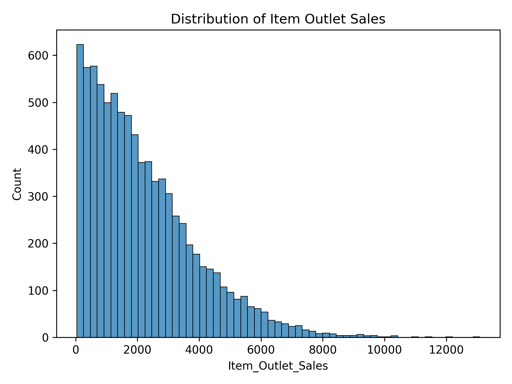
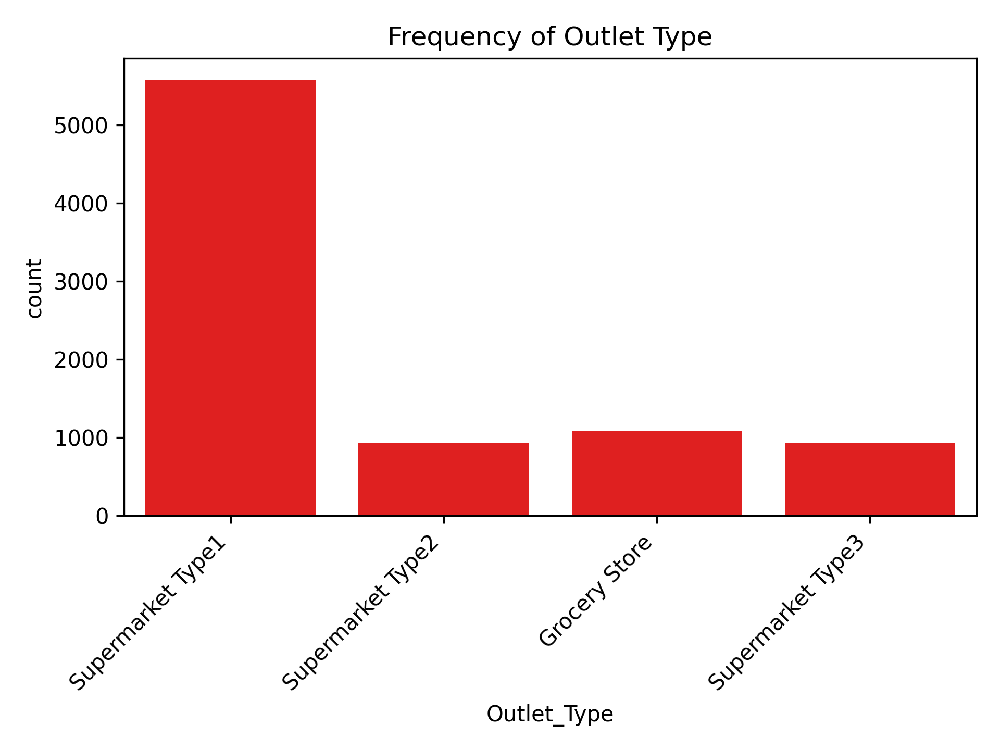
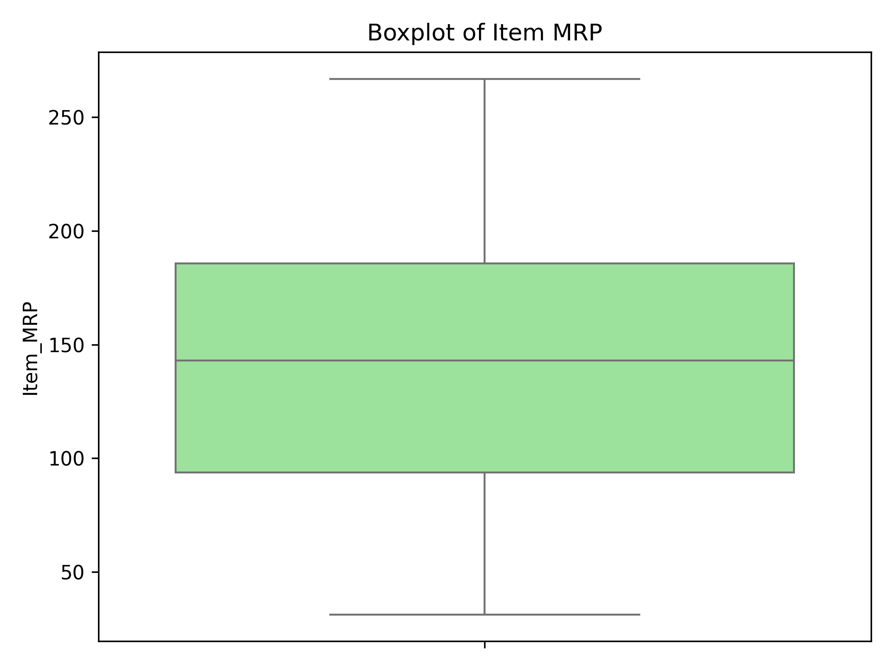
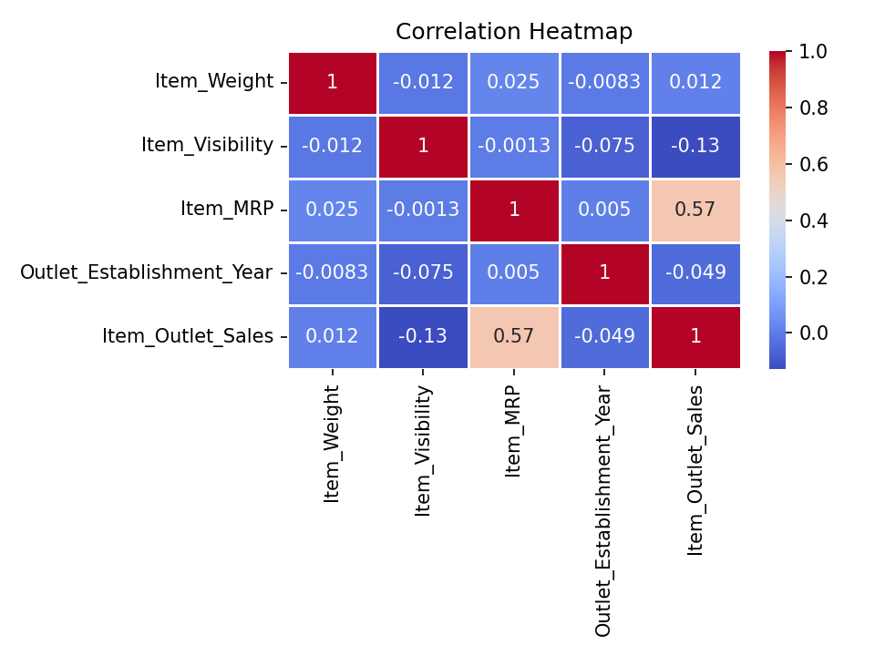

 
  

# Sales Prediction & Insights

## Analyzing Product and Outlet Factors that Influence Sales

### Data Source:
Big Mart Sales Dataset  
https://www.kaggle.com/datasets/brijbhushannanda1979/bigmart-sales-data

For this dataset, there were 8523 rows and 12 columns.

## To prepare this data, the data was cleaned, and the following processes were performed:

### Exploratory Data Analysis
- During the exploratory data analysis, a histogram was visualized 
  for `Item_Outlet_Sales` to understand its distribution, a countplot 
  for `Outlet_Type` to explore category frequencies, and a boxplot 
  for `Item_MRP` to examine the spread and outliers in item pricing.
- Also, a correlation heatmap was visualized to explore the 
  relationships between all numeric features.
- This gave a good baseline for all of the numeric and categorical 
  columns for univariate EDA.

  

Most products have low or medium sales. Only a few products reach high sales. This shows an imbalance in product performance and highlights the need to improve weaker items.

  

The countplot shows that `Supermarket Type1` is the most frequent outlet type in the dataset.

  

The boxplot shows that `Item_MRP` mostly ranges between 100 and 200, with a few outliers on the lower end.

  

The heatmap shows that the strongest correlation is between `Item_MRP` and `Item_Outlet_Sales` at **0.57**.
